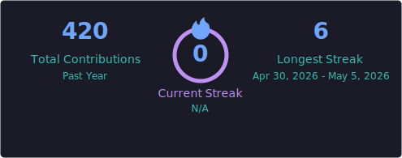

<h1 align="center">Hi there, I'm Thiago 👋</h1>
<h3 align="center">Front-End Engineer @ Amazon · Based in Austin, TX 🇺🇸</h3>

---

### 🚀 About Me

Front-end software developer passionate about tech innovation, agentic AI, and cost-optimized cloud architecture.

- 🔭 Currently building **module-federated experiences for Amazon PubTech** (Publishers & Advertisers)
- 🦞 Experimenting with **serverless AI agents** on AWS Bedrock AgentCore Runtime — see [openclaw-agentcore-personal](https://github.com/tverney/openclaw-agentcore-personal)
- 🧠 Building **persistent memory for AI agents** — see [agent-memory-daemon](https://github.com/tverney/agent-memory-daemon)
- 🌍 Working on **[llm-proxy-babylon](https://github.com/tverney/llm-proxy-babylon)** — a multilingual LLM proxy that optimizes non-English prompts for better quality, lower token cost, and stronger safety alignment
- 🏆 Graduated Founder — InovAtiva 2018.2 Acceleration Cycle & "English for Founders" (US Consulate in Brazil, 2019)
- 🌱 Exploring **Agentic AI**: A2A, MCP, custom skills, evals, and multi-model routing
- 🗣️ Languages: Portuguese (native) · English (advanced)

---

### 🛠️ Tech Stack

**Languages & Frameworks**

**Agentic AI**

**Cloud & Infra**

**APIs & Databases**

**Testing & Tooling**

---

### 📊 GitHub Stats

  
  

  

> Stats are refreshed daily via [GitHub Actions](.github/workflows/update-stats.yml).

---

### 🌐 Connect with Me

  
  

---

⭐ From <a href="https://github.com/tverney">tverney</a> — Day 1, always.

